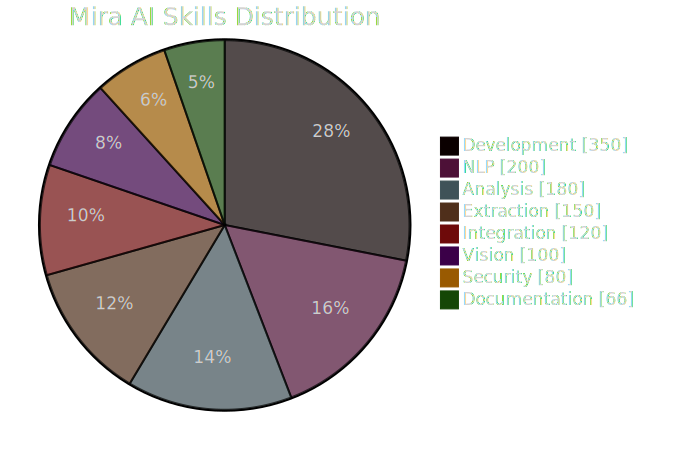
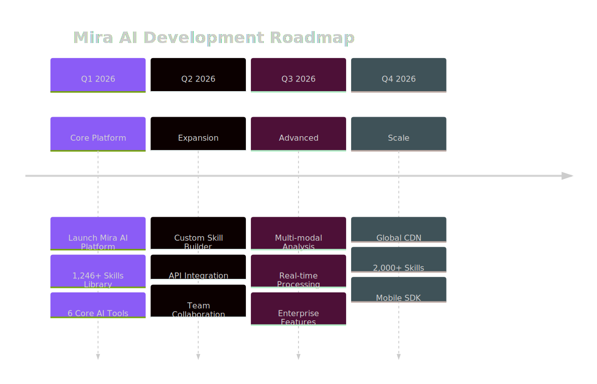

<p align="center">
  
</p>

<h1 align="center">Mira AI Skills Library</h1>

<p align="center">
  <strong>The Ultimate Collection of 1,246+ AI Skills for Intelligent Analysis, Code Understanding, and Content Generation</strong>
</p>

<p align="center">
  <a href="https://github.com/superbixnggas/Mira-AI/stargazers"></a>
  <a href="https://github.com/superbixnggas/Mira-AI/network/members"></a>
  <a href="https://github.com/superbixnggas/Mira-AI/issues"></a>
  <a href="LICENSE"></a>
</p>

<p align="center">
  <a href="https://kp3l1yzn507n.space.minimax.io"></a>
  <a href="#quick-start"></a>
  <a href="CATALOG.md"></a>
</p>

---

## What is Mira AI?

**Mira AI** is a skill-driven AI platform designed to help users analyze information, understand code, and generate insights using specialized AI capabilities. Instead of a single chatbot interface, Mira AI provides a **modular system of 1,246+ AI skills** designed for specific tasks.

<p align="center">
  <a href="https://kp3l1yzn507n.space.minimax.io">
    
  </a>
</p>

---

## Platform Architecture

<p align="center">
  
</p>

Our architecture is designed for **scalability**, **modularity**, and **intelligent processing**:

| Layer | Description |
|-------|-------------|
| **Input Layer** | Handles user queries, code, text, and URL inputs |
| **Mira AI Core** | Skill matching, context building, and reasoning engine |
| **Processing Layer** | Chain-of-thought reasoning and analysis modules |
| **Output Layer** | Structured responses, code explanations, and data extraction |

---

## Skills Distribution

<p align="center">
  
</p>

| Category | Count | Description |
|----------|-------|-------------|
| **Development** | 350+ | Code analysis, generation, and review |
| **NLP** | 200+ | Natural language processing tasks |
| **Analysis** | 180+ | Data analysis and insights |
| **Extraction** | 150+ | Data parsing and extraction |
| **Integration** | 120+ | API and service connections |
| **Vision** | 100+ | Image and visual analysis |
| **Security** | 80+ | Security review and auditing |
| **Documentation** | 66+ | Documentation generation |

---

## Core AI Tools

<table>
  <tr>
    <td align="center" width="33%">
      <br>
      <sub>AI-powered content creation</sub>
    </td>
    <td align="center" width="33%">
      <br>
      <sub>Code analysis & documentation</sub>
    </td>
    <td align="center" width="33%">
      <br>
      <sub>Document summarization</sub>
    </td>
  </tr>
  <tr>
    <td align="center">
      <br>
      <sub>Repository insights</sub>
    </td>
    <td align="center">
      <br>
      <sub>Site content extraction</sub>
    </td>
    <td align="center">
      <br>
      <sub>Structured data parsing</sub>
    </td>
  </tr>
</table>

---

## Quick Start

### Installation

```bash
# Install Mira AI Skills globally
npx mira-ai-skills

# Or install to a specific directory
npx mira-ai-skills --path ./my-skills
```

### Verify Installation

```bash
test -d ~/.mira/skills && echo "✅ Mira AI Skills installed successfully!"
```

### Using Skills

```
> "Use @code-explainer to analyze this function."
> "Run @article-summarizer on this document."
> "Use @content-generator to write about AI trends."
```

---

## Development Roadmap

<p align="center">
  
</p>

---

## Activity & Stats

<p align="center">
  
</p>

<p align="center">
  
  
</p>

---

## Star History

<p align="center">
  <a href="https://star-history.com/#superbixnggas/Mira-AI&Date">
    
  </a>
</p>

---

## Example Usage

<details>
<summary><b>Content Generation</b></summary>

```python
from mira_skills import ContentGenerator

generator = ContentGenerator()
result = generator.generate("Write about AI in healthcare")
print(result.content)
```
</details>

<details>
<summary><b>Code Explanation</b></summary>

```python
from mira_skills import CodeExplainer

explainer = CodeExplainer(language="python")
explanation = explainer.explain(code_snippet)
print(explanation.summary, explanation.details)
```
</details>

<details>
<summary><b>Data Extraction</b></summary>

```python
from mira_skills import DataExtractor

extractor = DataExtractor()
data = extractor.extract("John Doe, john@email.com, March 12, 2024")
print(data.entities)  # [Person, Email, Date]
```
</details>

---

## Browse All Skills

| Resource | Description |
|----------|-------------|
| [**CATALOG.md**](CATALOG.md) | Full skill catalog with descriptions |
| [**skills/**](skills/) | Individual skill files |
| [**skills_index.json**](skills_index.json) | Searchable skill index |
| [**docs/**](docs/) | Documentation and guides |

---

## Contributing

We welcome contributions! See [CONTRIBUTING.md](CONTRIBUTING.md) for guidelines.

<p align="center">
  <a href="https://github.com/superbixnggas/Mira-AI/graphs/contributors">
    
  </a>
</p>

---

## Community & Support

<p align="center">
  <a href="https://kp3l1yzn507n.space.minimax.io"></a>
  <a href="https://github.com/superbixnggas/Mira-AI/issues"></a>
  <a href="https://github.com/superbixnggas/Mira-AI/discussions"></a>
</p>

---

## License

This project is licensed under the **MIT License** - see the [LICENSE](LICENSE) file for details.

---

## Acknowledgments

- Inspired by [Antigravity Awesome Skills](https://github.com/sickn33/antigravity-awesome-skills)
- Powered by Claude-style advanced reasoning
- Built for the Mira AI Platform

---

<p align="center">
  
</p>

<p align="center">
  <strong>Mira AI</strong> - Intelligent AI Skills for Everyone<br>
  <sub>Made with ❤️ by the Mira AI Team</sub>
</p>
